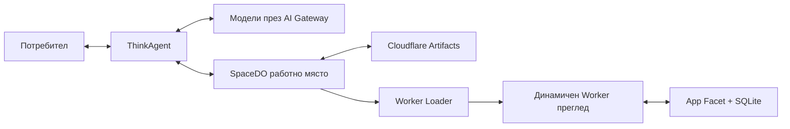

# Vibeship

> Платформа за „vibe coding“ на български — описваш идея, агентът построява истинско full-stack приложение и го публикува в Cloudflare.

Vibeship е форк на [Cloudflare VibeSDK](https://github.com/cloudflare/vibesdk), пренаписан за
български потребители и допълнен с абонаменти и кредитна система в стила на Lovable.

- Целият интерфейс е на български (с превключване към английски).
- Всеки проект получава Worker за API, Durable Object работно място, изолирана SQLite база
  и жив преглед.
- Кодът отива в GitHub репо на потребителя, а приложението се публикува в Cloudflare —
  от плана „Про“ нагоре в **неговия собствен** Cloudflare акаунт.
- Плащанията минават през Stripe: месечни планове плюс еднократни пакети кредити.

## Как работи

| Част | Роля |
|---|---|
| `ThinkAgent` | Агентът (Cloudflare Think) в Durable Object, който върти цикъла модел → инструменти |
| `SpaceDO` | Работното място на всеки проект — файловете и хранилището |
| Cloudflare Artifacts | Git история и точки за връщане назад |
| Worker Loader | Зарежда сглобения код като динамичен Worker за преглед |
| Генерираното `App` | Durable Object Facet със собствена SQLite база |
| AI Gateway | Маршрутизира моделите с наблюдаемост и кеш |
| D1 | Базата на платформата: потребители, проекти, абонаменти, кредити |



## Екрани

| Път | Екран |
|---|---|
| `/` | Представяне (за гости) или „Моите проекти“ (за влезли) |
| `/chat/:id` | Работното място — чат вляво, преглед/код/данни вдясно |
| `/deploy/:id` | Публикуване и GitHub за конкретен проект |
| `/credits` | Кредити, дневна употреба и дневник на разходите |
| `/pricing` | Планове, пакети кредити и Enterprise |
| `/settings` | Профил, свързани акаунти, модели |

## Планове и кредити

Плановете са дефинирани на едно място — [`shared/types/billing.ts`](shared/types/billing.ts) —
и се ползват както от Worker-а, така и от интерфейса.

| План | Цена | Кредити/мес | Активни проекта | Пренос | Публикуване в свой Cloudflare |
|---|---|---|---|---|---|
| Безплатен | 0 € | 5 | 1 | не | не |
| Старт | 19 € | 100 | 3 | 2 мес. | не |
| Про | 49 € | 250 | без лимит | 2 мес. | да |
| Екип | 129 € | 500 (споделени) | без лимит | 2 мес. | да |

Пакети за еднократна покупка: 100 кредита за 9 €, 300 кредита за 24 €.

**Цена на действията:** съобщение до агента — 1 кредит, публикуване — 2, създаване на
проект — 4, индексиране за RAG — 5.

Кредитите се харчат в три кофи, в този ред:

1. **месечна дажба** — нулира се в началото на всеки период;
2. **пренесени** — това, което е останало от предходни месеци, валидно до 2 месеца;
3. **купени с пакет** — не изтичат.

Така потребителят винаги първо изразходва това, което така или иначе ще изгори.
Провалено публикуване връща кредитите си автоматично.

Всяко движение се записва в `credit_ledger` с текущото салдо, така че екранът „Кредити“
показва история, а не само число.

## Пускане на своя инсталация

Нужни са:

- Cloudflare акаунт с платен план за Workers;
- Cloudflare API токен с права за ресурсите, които `setup` създава;
- собствен домейн за продукция (без домейн се работи на `workers.dev`);
- (по избор) Stripe акаунт, ако искаш платени планове;
- (по избор) Workers for Platforms — виж „Какво е опционално“ по-долу.

Ключ за доставчик на модели **не е задължителен**: ако не е зададен
`<ДОСТАВЧИК>_API_KEY`, Worker-ът се удостоверява пред AI Gateway със самия
Cloudflare токен (`worker/agents/inferutils/core.ts`, `getApiKey`), а ключовете
на доставчика живеят в самия gateway.

### Вариант А: всичко с wrangler

```bash
bun install
bun run setup        # създава D1, KV, R2, dispatch namespace, AI Gateway и попълва wrangler.jsonc
bun run db:migrate:remote
bun run deploy       # + създава dispatch namespace и качва шаблоните в R2
```

### Вариант Б: публикуване през GitHub интеграцията на Cloudflare

Интеграцията пуска обикновен `wrangler deploy`, който **само чете**
`wrangler.jsonc` — не създава ресурси и не качва шаблони. Затова ресурсите се
подготвят веднъж, а нататък всяко merge публикува само по себе си.

1. Създай ръчно D1, KV, R2 кофата `vibeship-templates` (и dispatch namespace,
   ако имаш Workers for Platforms).
2. Впиши `database_id` и KV `id` в `wrangler.jsonc`.
3. Приложи схемата: `bun run db:migrate:remote` **или** SQL от
   [`migrations/console/`](migrations/console/) в конзолата на D1. Двата пътя
   не се смесват — README-то там обяснява защо.
4. Свържи репото към Worker-а и публикувай.
5. Добави `CLOUDFLARE_API_TOKEN` и `CLOUDFLARE_ACCOUNT_ID` като secrets на
   Worker-а. Те не трябват при публикуване, но без тях приложението гърми,
   щом потребител натисне „Публикувай“.

### Какво е опционално

| Ресурс | Без него |
|---|---|
| Workers for Platforms | Прегледите работят (SpaceDO и Worker Loader), а публикуването отива в акаунта на потребителя. Липсва само хостване върху поддомейните на платформата. Биндингът стои коментиран в `wrangler.jsonc`. |
| Cloudflare Artifacts | Затворена бета. Биндингът е коментиран, защото иначе `wrangler deploy` връща 10015. |
| Шаблони в R2 | Deploy-ът минава, но агентът няма от какво да тръгне при нов проект. Качват се с `bun run deploy`. |

За локална разработка:

```bash
cp .dev.vars.example .dev.vars   # попълни ключовете, които ти трябват
bun run db:migrate:local
bun run dev
```

Пълните стъпки, права на токена, DNS и OAuth настройките са в [`docs/setup.md`](docs/setup.md).

### Stripe

1. Създай в Stripe четири повтарящи се цени (Старт, Про, Екип) и две еднократни (пакетите).
2. Сложи ги като тайни на Worker-а:

```bash
wrangler secret put STRIPE_SECRET_KEY
wrangler secret put STRIPE_WEBHOOK_SECRET
wrangler secret put STRIPE_PRICE_STARTER
wrangler secret put STRIPE_PRICE_PRO
wrangler secret put STRIPE_PRICE_TEAM
wrangler secret put STRIPE_PRICE_PACK_100
wrangler secret put STRIPE_PRICE_PACK_300
```

3. Насочи Stripe webhook към `https://<твоя-домейн>/api/billing/webhook` и включи събитията
   `checkout.session.completed`, `customer.subscription.created`, `customer.subscription.updated`,
   `customer.subscription.deleted`, `invoice.payment_failed`.

Без `STRIPE_SECRET_KEY` платформата работи нормално, но само с безплатния план — платените
бутони се скриват сами.

## API за абонаменти

| Метод | Път | Какво прави |
|---|---|---|
| `GET` | `/api/billing/plans` | Плановете и пакетите (публично) |
| `GET` | `/api/billing/summary` | План, салдо, употреба и дневник |
| `POST` | `/api/billing/checkout` | Stripe Checkout за абонамент |
| `POST` | `/api/billing/topup` | Еднократна покупка на пакет кредити |
| `POST` | `/api/billing/portal` | Портал за смяна на карта, отказ, фактури |
| `POST` | `/api/billing/webhook` | Приема събитията на Stripe (проверен подпис) |

## Език на интерфейса

Речниците са в [`src/i18n`](src/i18n) — `bg.ts` е основният, `en.ts` е резервният. Компонентите
ползват `useT()`:

```tsx
const t = useT();
<h1>{t('projects.greeting', { name: 'Мария' })}</h1>
```

Липсващ ключ се показва като самия ключ, за да личи в ревю.

## Разработка

```bash
bun run dev          # локален сървър
bun run typecheck    # TypeScript
bun run lint         # ESLint
bun run test         # Vitest
bun run db:generate  # нова миграция след промяна в schema.ts
```

## Лиценз

MIT — виж [LICENSE](LICENSE). Основата е Cloudflare VibeSDK, © Cloudflare, също под MIT.
